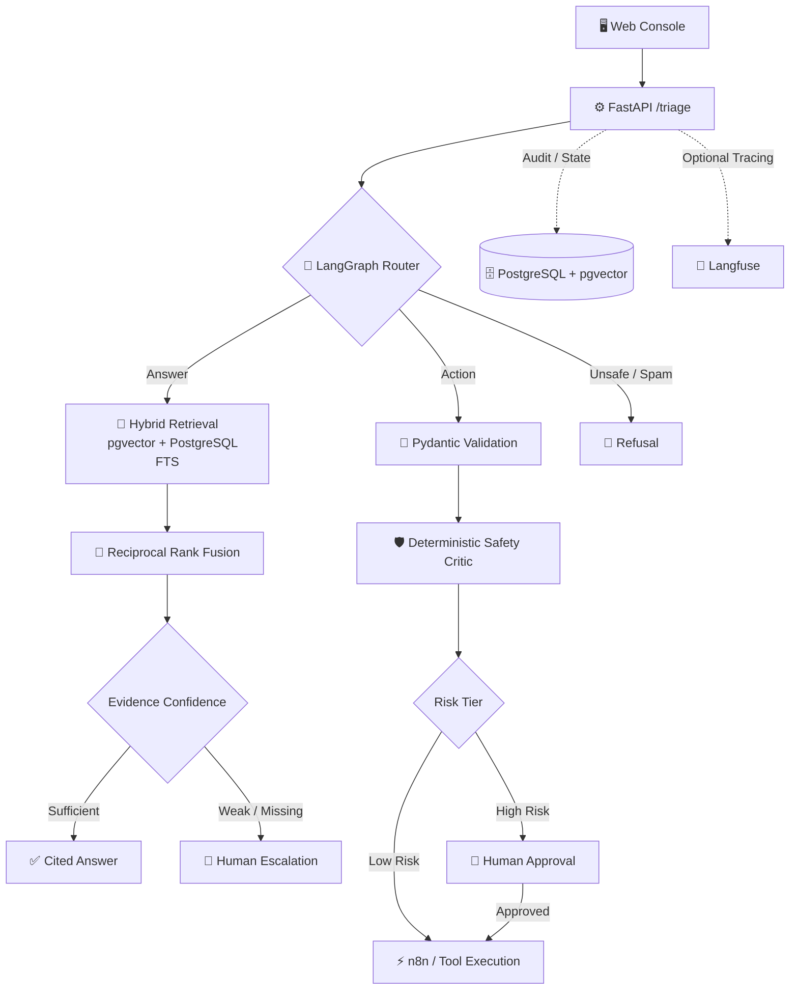

<a id="top"></a>

<div align="center">

# 🛡️ Sentinel


<br />

**Answers from documentation. Executes only authorized tools. Escalates when evidence is insufficient.**

<br /><br />


<br />

<a href="./evals/reports/latest.md">
  
</a>

<a href="./LICENSE">
  
</a>

<br /><br />

**[Why Sentinel](#why-sentinel) · [Architecture](#architecture) · [Evaluation](#evaluation) · [Safety](#safety) · [Case Study](#case-study) · [Run Locally](#run-locally)**

<br /><br />


</div>

---

<a id="why-sentinel"></a>

## 🧭 Why Sentinel

Customer-support AI has two failure modes that matter more than sounding impressive:

1. **Giving a confident answer without sufficient evidence**
2. **Performing an action that should never have been executed**

Sentinel is built around a stricter rule:

> ### Cite the evidence, perform only authorized actions, or escalate.

Every incoming request is routed through one of four paths:

| Route | Behavior |
|---|---|
| 🟢 **Answer** | Retrieves supporting documentation and returns a cited response. |
| 🟡 **Action** | Validates parameters and invokes an allow-listed automation. |
| 🔴 **Escalate** | Hands the request to a human when evidence, intent, or safety is insufficient. |
| ⚪ **Refuse / Spam** | Rejects unsafe or irrelevant requests without taking an action. |

Sentinel is designed as an **AI support operator**, not just a chatbot: retrieval, decision-making, tools, approvals, traces, and evaluation are part of the same system.

---

## 🧱 What I Built

| Area | Implementation |
|---|---|
| 🔎 **Grounded RAG** | Heading-aware ingestion, pgvector semantic retrieval, PostgreSQL full-text search, Reciprocal Rank Fusion, confidence gating, and stable citation IDs. |
| 🕸️ **Agent orchestration** | LangGraph state machine routing requests through answer, action, escalation, and refusal paths. |
| 🔐 **Safe automation** | Pydantic-validated n8n tools, deterministic safety checks, risk tiers, human approvals, and idempotency protection. |
| 🖥️ **Operator console** | Next.js interface for requests, citations, traces, approvals, audit events, usage, and triage. |
| 📈 **Observability** | Persisted runs, step-level audit events, token/cost tracking, and optional Langfuse tracing. |
| 🧪 **Evaluation** | Deterministic regression testing for expected system behavior plus a separate semantic LLM-as-judge evaluation for RAG quality. |

---

<a id="architecture"></a>

# 🗺️ Architecture

<p align="center">
  
</p>

A request moves through four broad stages:

**ingress → routing → route-specific execution → persisted evidence**



The LLM is not responsible for every decision.

Where behavior can be deterministic — parameter validation, authorization, approval rules, risk checks, and tool policy — Sentinel uses code rather than relying only on model judgment.

---

<a id="evaluation"></a>

# 📊 Evaluation

Sentinel separates **deterministic system correctness** from **probabilistic semantic quality**.

These are deliberately reported as different evaluations.

---

## ✅ Deterministic Regression Suite

The pull-request evaluation gate executes:

# **245 / 245 deterministic regression cases passing**

Each case has a fixed expected outcome and evaluates behaviors such as:

- routing
- escalation
- authorization
- citation requirements
- tool selection
- approval behavior
- safety rules
- reliability fallbacks
- adversarial requests

| Metric | Result |
|---|---:|
| Scenarios executed | **245 / 245** |
| Overall pass rate | **100%** |
| Citation checks | **90 / 90** |
| Tool-selection checks | **120 / 120** |
| Approval-safety checks | **282 / 282** |
| Reliability-fallback checks | **55 / 55** |
| Adversarial-safety checks | **160 / 160** |
| Critical policy failures | **0** |

> These capability checks overlap: one scenario may validate several properties.

**245 / 245 does not mean 100% AI, RAG, or semantic accuracy.**

It means every deterministic regression case produced its predefined expected system behavior.

📄 **[View deterministic evaluation report →](./evals/reports/latest.md)**

---

## 🧠 Semantic RAG Evaluation

A separate calibrated **LLM-as-judge evaluation** measures the probabilistic parts of the system: retrieval quality, answer correctness, and citation grounding.

### Latest committed semantic evaluation

| Metric | Result |
|---|---:|
| Cases evaluated | **300** |
| Overall pass rate | **96.0%** |
| Answer correctness | **90.9%** |
| Citation faithfulness | **89.1%** |
| Retrieval hit rate | **80.0%** |
| Critical policy failures | **0** |

These numbers are intentionally reported separately from the deterministic suite.

Semantic RAG performance is not expected to be perfect. The current results show that deterministic routing and safety behavior are strong on the defined regression suite, while **retrieval coverage and citation relevance remain the primary semantic quality bottlenecks**.

The committed report also preserves failed cases rather than hiding them.

📄 **[View full 300-case semantic report →](./evals/reports/semantic_300/latest.md)**

---

## 🧪 Safety Regression Coverage

In addition to the larger evaluation suites, focused backend regression tests cover failure modes such as:

- answer generated without a valid citation
- fabricated citation IDs
- mixed valid and unsupported citations
- low-confidence retrieval
- empty retrieval
- malformed tool parameters
- duplicate tool invocation
- rejected high-risk actions
- repeated approval attempts
- HTTP-success responses whose payload explicitly reports failure

These tests exist to protect specific safety invariants discovered during implementation rather than to inflate the headline evaluation count.

---

<a id="safety"></a>

# 🛡️ Safety

Sentinel follows a fail-safe philosophy for uncertain AI decisions.

| Failure / Risk | Sentinel Behavior |
|---|---|
| No supporting citation | Escalates instead of returning an unsupported answer |
| Fabricated citation | Rejects the answer and escalates |
| Weak retrieval evidence | Escalates instead of inventing an answer |
| Empty retrieval | Escalates |
| Router / generation-model failure | Falls back to escalation |
| Malformed model output | Uses a safe fallback |
| Unsafe or prompt-injection request | Blocks execution and escalates |
| Invalid tool parameters | Does not invoke the external action |
| High-risk action | Requires human approval |
| Rejected high-risk action | Never executes |
| Duplicate low-risk action | Reuses the idempotent result |
| Retrieval dependency unavailable | Escalates instead of generating an unverified answer |
| Tool transport failure | Does not report the action as successful |
| Explicit `{"ok": false}` tool response | Treated as a failed action even when HTTP status is 200 |

### Core invariant

<p align="center">
  
</p>

> 🔒 High-risk actions are checked before entering the approval flow and again before execution.

---

<a id="case-study"></a>

# 🔬 Public Documentation Case Study

To test Sentinel outside the project's internal documentation corpus, I created a small, frozen support benchmark derived from publicly available Render documentation.

| | |
|---|---|
| 🎫 **Frozen tickets** | 5 author-created support scenarios |
| 🧪 **Checks per ticket** | 8 deterministic checks |
| 📉 **Baseline configuration** | **2 / 5** strict passes |
| 📈 **Improved configuration** | **5 / 5** strict passes |
| ⚖️ **Trade-off** | Mean latency increased from **9.8 s → 63.5 s** with the improved local 8B configuration |

The purpose of the experiment is not to claim production-level benchmarking.

It demonstrates an important engineering trade-off:

> **Higher model quality can improve task success while significantly increasing latency.**

The case study is an independent technical experiment and does **not** imply a Render partnership, endorsement, or production deployment.

📄 **[Read the Sentinel × Render case study →](./case-studies/render-public-docs.md)**

---

# 🧰 Tech Stack

<div align="center">

### Backend & Orchestration


### Retrieval & Data


### Models & Automation


### Frontend


### Testing & Observability


</div>

---

<a id="run-locally"></a>

# ⚡ Run Locally

## Prerequisites

- Docker Desktop with Compose
- Python 3.12+
- Node.js 20+
- Ollama  
  **or**
- Gemini API key for hosted chat generation

---

## 1. Configure Services

```bash
cp .env.example .env

ollama pull nomic-embed-text
ollama pull llama3.2:3b

docker compose up -d --wait
```

To use Gemini for chat generation while keeping embeddings local:

```dotenv
LLM_PROVIDER=gemini
CHAT_MODEL=gemini-2.5-flash
GEMINI_API_KEY=your-backend-only-key

EMBED_PROVIDER=ollama
EMBED_MODEL=nomic-embed-text
```

---

## 2. Start the Backend

```bash
cd backend

python -m venv .venv
```

### Windows

```bash
.venv\Scripts\activate
```

### macOS / Linux

```bash
source .venv/bin/activate
```

Install dependencies and initialize Sentinel:

```bash
python -m pip install -r requirements.txt

python -m app.cli init
python -m app.cli ingest --reset

uvicorn app.main:app --reload --port 8000
```

API documentation:

**http://localhost:8000/docs**

---

## 3. Start the Operator Console

```bash
cd frontend

npm install
npm run dev
```

Open:

**http://localhost:3000**

For local n8n workflows, import the supplied workflow definitions using:

📄 **[n8n setup guide →](./n8n/README.md)**

---

# 📁 Repository Structure

```text
backend/
├── app/            FastAPI, RAG, LangGraph, tools, providers and audit logic
└── tests/          Backend and safety regression tests

frontend/           Next.js operator console and API proxy routes

docs/               Documentation corpus used by Sentinel

evals/              Deterministic + semantic evaluation suites and reports

n8n/                Workflow exports and supporting setup

finetune/           Reproducible LoRA routing experiment

case-studies/       Public-documentation evaluation experiments

DEPLOY.md           Portfolio/demo deployment guidance
```

---

# 🧩 Current Limitations

Sentinel is intentionally presented with its current limitations rather than hiding them:

- The implemented inbound interface is currently the **web console**; external email/chat adapters are future work.
- Semantic RAG quality is not perfect; **retrieval coverage and citation relevance** remain the largest measured quality gaps.
- The public Render case study contains only five frozen scenarios and should be treated as a technical demonstration rather than a statistically significant benchmark.
- A public hosted demo is **not currently live**.
- High-risk actions default to **simulated execution** in the provided production Compose configuration. Real destructive or financial actions should only be connected inside an appropriate sandboxed integration.

---

# 🎯 Design Philosophy

Sentinel intentionally avoids making every part of the system agentic.

LLMs handle tasks where language understanding and reasoning are useful.

Deterministic code handles rules that should remain predictable:

```text
LLM
├── intent understanding
├── answer generation
└── semantic reasoning

CODE
├── parameter validation
├── authorization
├── risk classification
├── approval requirements
├── tool policy
└── regression gates
```

The goal is not maximum autonomy.

The goal is **useful automation with explicit evidence, controlled actions, and observable failure behavior**.

---

# 📄 License

MIT License © 2026 **Achal Verma**

Evaluation and case-study metrics in this README are backed by reproducible reports or test artifacts included in the repository.

<div align="center">

**[↑ Back to top](#top)**

</div>
