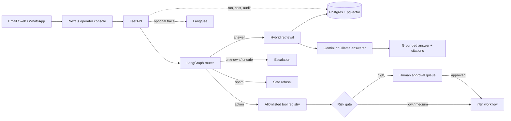

<h1 align="center">Sentinel</h1>

<p align="center">
  <strong>An evidence-first AI support operator: cited answers, controlled actions, and human approval for risk.</strong><br />
  <em>LLM brain. n8n hands. A complete audit trail.</em>
</p>

<p align="center">
  
  
  
  
  
  
  
</p>

Sentinel receives a support request, decides whether to answer, act, escalate, or reject spam, and exposes the evidence behind that decision. Answers are grounded in retrieved documentation. Low-risk actions run through n8n. High-risk actions wait in an approval queue. Every route, citation, tool decision, token, cost, and approval is inspectable in the operator console.

> The central contract is simple: **prove the answer with citations, or hand it to a human.**

## Live console walkthrough

The capture below was recorded against the local stack. It submits a real documentation question, returns a grounded answer, opens its persisted trace, and finishes on the generated evaluation report.


## What is working

- **Evidence-backed answers:** hybrid vector and full-text retrieval, Reciprocal Rank Fusion, a confidence gate, and stable citation IDs.
- **Agentic routing:** a LangGraph pipeline routes requests to `answer`, `action`, `escalate`, or `spam`.
- **Controlled tools:** an allowlisted registry selects and validates n8n tools. Repeated low-risk requests are idempotent.
- **Human approval:** financial and other high-risk actions are queued; approval triggers the tool, while rejection closes the request safely.
- **Operational visibility:** Postgres-backed run history, per-step audit events, token/cost accounting, and optional self-hosted Langfuse traces.
- **Live operator console:** inbox, request trace, approval queue, cost and usage, evaluation results, and a request console.
- **Release evidence:** deterministic evaluation gates run on every pull request; a calibrated LLM judge separately scores answer correctness and citation faithfulness.

## Architecture



The knowledge base is **Meridian**, a fictional SaaS platform with stable section IDs such as `[key-06]`. Keeping the corpus deterministic makes every citation expectation reproducible. The same ingestion pipeline can index a different Markdown corpus.

## Measured results

Latest checked-in deterministic report: **21 August 2026**.

| Metric | Result |
|---|---:|
| Cases executed | **245 / 245** |
| Overall pass rate | **100%** |
| Routing | **245 / 245** |
| Citation checks | **90 / 90** |
| Tool selection | **120 / 120** |
| Approval safety | **282 / 282** |
| Reliability fallback | **55 / 55** |
| Adversarial safety | **160 / 160** |
| Multi-turn behavior | **40 / 40** |
| Critical policy failures | **0** |
| Unimplemented checks | **0** |

These are capability checks, so some cases contribute to more than one row. See the [complete generated score table](./evals/reports/latest.md) and [evaluation design](./evals/README.md).

The repository also contains a **300-case semantic suite**. Its structured local judge scores correctness, citation faithfulness, unsupported claims, policy compliance, and clarification behavior. Judge output is accepted only after the chosen model passes fixed calibration anchors. The checked-in table above is the deterministic PR gate; it is not presented as an LLM-judge result.

### Target-company documentation test

Sentinel was also tested independently against eight hand-curated, attributed sections derived from Render's public documentation. The same five frozen support tickets improved from **2 / 5** to **5 / 5** under an eight-check deterministic contract after a combined prompt, output-parsing, and model change. The full [Render public-docs case study](./case-studies/render-public-docs.md) includes the fresh-reader failure it uncovered and links every numerical claim to the corpus, rubric, and saved per-ticket reports. This is an independent demonstration, not a Render engagement or endorsement.

## Reliability evidence

Faults are injected at controlled boundaries so the release suite can prove behavior without taking down a developer's machine.

| Injected condition | Required behavior | Current evidence |
|---|---|---|
| Router model unavailable | Fail closed to escalation | Regression test + golden cases + physical shutdown test |
| Malformed router response | Fail closed to escalation | Regression test + golden reliability cases |
| Tool timeout | Do not report a successful action; use the defined fallback | Golden reliability cases |
| Unsafe tool proposal | Block before execution | Critic and safety regression tests |
| Database unreachable | Fail quickly to human escalation; never fabricate an answer | Regression test + physical shutdown test |

The latest suite passes **55 / 55 reliability-fallback checks**. The repository also contains opt-in tests that physically stop and restore local Ollama and the exact `sentinel-db` Compose service. They are excluded from ordinary test runs so a pull request cannot unexpectedly stop a developer's services.

Run the physical shutdown checks on a controlled local machine after starting Ollama and `docker compose up -d --wait db`:

```powershell
$env:PYTHONPATH = (Resolve-Path backend).Path
$env:RUN_LIVE_SHUTDOWN_TESTS = "1"
python -m pytest -q -s backend/tests/test_live_dependency_shutdown.py
```

On non-Windows hosts, also provide `OLLAMA_STOP_COMMAND` and `OLLAMA_START_COMMAND`. Both tests restore their dependency in `finally`; the Postgres test additionally verifies that the chunk count is unchanged after restart.

## Quickstart

### Prerequisites

- Docker Desktop with Compose
- [Ollama](https://ollama.com)
- Python 3.12 or newer
- Node.js 20 or newer

### 1. Configure and start the services

```bash
cp .env.example .env
ollama pull nomic-embed-text
# Only needed when LLM_PROVIDER=ollama:
ollama pull llama3.2:3b
docker compose up -d --wait
```

This starts Postgres on `5432`, n8n on `5679`, and Langfuse on `3001`. Values can be changed in `.env`.

Sentinel supports independent chat and embedding providers. This hybrid keeps retrieval local and moves the heavier reasoning calls off the laptop:

```dotenv
LLM_PROVIDER=gemini
CHAT_MODEL=gemini-2.5-flash
GEMINI_API_KEY=your-backend-only-key
EMBED_PROVIDER=ollama
EMBED_MODEL=nomic-embed-text
```

Keep `GEMINI_API_KEY` only in the root `.env`; it is ignored by Git and must never use a `NEXT_PUBLIC_` prefix. Set both providers to `ollama` for a fully local deployment. Gemini embeddings are supported at 768 dimensions, but switching embedding providers requires a complete re-ingestion because vectors from different models cannot be mixed.

### 2. Prepare and run the API

```bash
cd backend
python -m venv .venv

# Windows
.venv\Scripts\activate

# macOS / Linux
# source .venv/bin/activate

python -m pip install -r requirements.txt
python -m app.cli init
python -m app.cli ingest --reset
uvicorn app.main:app --reload --port 8000
```

The API is now available at [http://localhost:8000/docs](http://localhost:8000/docs).

### 3. Run the operator console

In another terminal:

```bash
cd frontend
npm install
npm run dev
```

Open [http://localhost:3000](http://localhost:3000). The frontend's same-origin handlers proxy to `SENTINEL_API_URL`, which defaults to `http://localhost:8000`. Create `frontend/.env.local` only when the API uses a different address:

```dotenv
SENTINEL_API_URL=http://localhost:8199
```

The answer path is ready after ingestion. To execute ticket and invoice workflows, import and activate the supplied n8n workflows using the [n8n setup guide](./n8n/README.md).

## Operator views

| Route | Purpose |
|---|---|
| `/` | Product overview, live system configuration, and latest eval result |
| `/inbox` | Persisted requests with route and status filters |
| `/requests/:id` | One request's citations, usage, decision, and audit trail |
| `/approvals` | Human review for high-risk actions |
| `/usage` | Live request, latency, model, channel, cost, and eval metrics |
| `/console` | Submit a request to the production graph |

The interface does not substitute fake traffic or sample metrics. If the API is unavailable, live values remain unknown and the console shows an offline state.

## API surface

| Method | Endpoint | Purpose |
|---|---|---|
| `GET` | `/health` | Service health |
| `GET` | `/system` | Runtime model, retrieval, tool, and tracing configuration |
| `POST` | `/ask` | Retrieval-augmented answer or escalation |
| `POST` | `/triage` | Full routing and action graph |
| `GET` | `/runs` | Recent persisted runs |
| `GET` | `/runs/{id}` | Run detail and audit steps |
| `GET` | `/stats` | Live operational aggregates |
| `GET` | `/approvals` | Approval queue |
| `POST` | `/approvals/{id}/approve` | Approve and trigger a queued tool |
| `POST` | `/approvals/{id}/reject` | Reject without execution |

## Run the evaluations

The fast deterministic gate exercises the production graph with unsafe external boundaries replaced by in-memory recorders:

```bash
python -m evals.runners.run_golden
```

For local semantic scoring, first pull a stronger judge model, calibrate that exact model and prompt, and then run the suite:

```bash
ollama pull llama3.1:8b
python -m evals.judges.calibrate --model llama3.1:8b
python -m evals.runners.run_golden --judge ollama --judge-model llama3.1:8b
```

The pull-request workflow publishes the generated Markdown score table on the GitHub Actions run summary and uploads the full JSON/Markdown reports. A weekly or manually triggered self-hosted workflow ingests the knowledge base and runs all 300 cases with the calibrated semantic judge.

## Repository map

```text
Sentinel/
├── backend/app/                 FastAPI, graph, RAG, tools, approvals, audit
├── backend/tests/               safety, graph, conversation, tool and trace tests
├── frontend/                    Next.js operator console and API proxy routes
├── docs/                        Meridian knowledge base
├── evals/                       300-case dataset, judges, runners and reports
├── n8n/                         SQL, workflow exports and setup guide
├── finetune/                    reproducible LoRA routing experiment
├── .github/workflows/           pull-request and full semantic evaluation gates
└── docker-compose.yml           Postgres, n8n and self-hosted Langfuse
```

## Delivery status

- [x] LLM-as-judge implementation and model-specific calibration
- [x] Deterministic evaluations in pull-request CI with a visible score table
- [x] Deterministic reliability and safety fault injection
- [x] Current README, architecture diagram, quickstart, evidence table, and live demo GIF
- [x] Physical Ollama and Postgres shutdown integration tests
- [x] Five-ticket target-company public-docs demo and final case study
- [x] Evidence-mapped project bullets
- [ ] Public demo link

Only a public deployment destination remains; no public endpoint is implied by the current repository.

## License

[MIT](./LICENSE) © 2026 Achal Verma

<p align="center"><sub>Every numerical claim above links back to a generated report or executable test.</sub></p>
