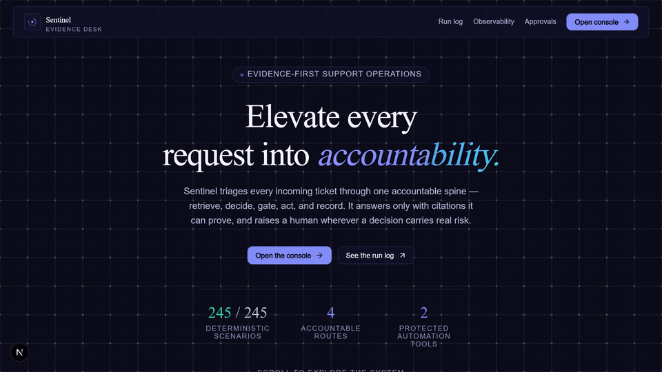
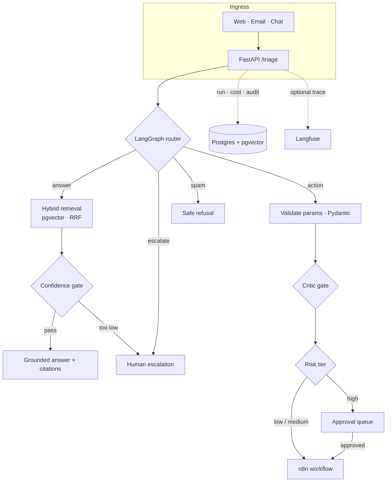

<h1 align="center">Sentinel</h1>

<p align="center">
  <strong>An evidence-first AI support operator.</strong><br />
  It answers only when it can cite the source, acts only through tools it's allowed to use, and asks a human before anything risky.
</p>

<p align="center">
  
  
  
  
  
  
  
</p>

---

Most "AI support" bots answer with total confidence whether or not they actually know the answer — and they'll happily take actions no one signed off on. Sentinel is built around the opposite instinct.

When a request comes in, Sentinel decides what to do with it: **answer** it from the docs, take an **action** on the user's behalf, **escalate** it to a person, or drop it as **spam**. Whatever it chooses, it shows its work. Answers come with the exact passages they're based on. Actions only run if they're on an allow-list and their parameters check out. Anything high-risk waits in a queue for a human to approve. And every step — the route it picked, the chunks it cited, the tokens it burned, the approval someone granted — is written down and inspectable in the console.

> The whole thing rests on one promise: **prove the answer with a citation, or hand it to a human.** No confident guessing.

## See it in action

Recorded against the local stack — it asks a real documentation question, gets a grounded answer, opens the persisted trace behind that answer, and lands on the generated evaluation report.



## What it does

- **Answers you can trust** — hybrid vector + full-text retrieval over pgvector, fused with Reciprocal Rank Fusion, gated on a confidence threshold. Sources carry stable citation IDs, so an answer can point at the exact section it used.
- **Routing with intent** — a LangGraph pipeline sends each request to `answer`, `action`, `escalate`, or `spam`, based on intent, urgency, and how confident retrieval is.
- **Tools with guardrails** — an allow-listed registry picks and validates the right n8n tool. Repeated low-risk requests are idempotent, so a retry never fires an action twice.
- **A human in the loop where it counts** — refunds, cancellations, and other high-risk actions don't just happen. They queue for review; approving fires the tool, rejecting closes the request cleanly.
- **Nothing happens off the record** — Postgres-backed run history, per-step audit events, token and cost accounting, and optional self-hosted Langfuse traces.
- **A real operator console** — inbox, request traces, the approval queue, cost and usage, evaluation results, and a live console to submit requests to the production graph.
- **Evidence at release time** — deterministic evaluation gates run on every pull request, and a calibrated LLM judge separately scores answer correctness and citation faithfulness.

## How it works

One request flows through four layers — ingress, a routing decision, the route's own sub-pipeline, and a permanent record — so every outcome is traceable back to the evidence and gates behind it.



The knowledge base is **Meridian**, a fictional SaaS platform whose docs use stable section IDs like `[key-06]`. A deterministic corpus means every citation expectation is reproducible — but the same ingestion pipeline will happily index any other Markdown corpus.

## Measured results

Latest checked-in deterministic report: **21 August 2026**.

| Metric | Result |
|---|---:|
| Cases executed | **245 / 245** |
| Overall pass rate | **100%** |
| Routing | **245 / 245** |
| Citation checks | **90 / 90** |
| Tool selection | **120 / 120** |
| Approval safety | **282 / 282** |
| Reliability fallback | **55 / 55** |
| Adversarial safety | **160 / 160** |
| Multi-turn behavior | **40 / 40** |
| Critical policy failures | **0** |
| Unimplemented checks | **0** |

These are capability checks, so some cases show up in more than one row. The [full generated score table](./evals/reports/latest.md) and the [evaluation design](./evals/README.md) have the details.

There's also a **300-case semantic suite**. Its local judge scores correctness, citation faithfulness, unsupported claims, policy compliance, and clarification behavior — but only after the chosen model clears fixed calibration anchors. The table above is the deterministic PR gate, not an LLM-judge result; the two are kept separate on purpose.

### Tested against real-world docs

Sentinel was also put up against eight hand-curated, attributed sections from Render's public documentation. The same five frozen support tickets went from **2 / 5** to **5 / 5** under an eight-check deterministic contract after a combined prompt, output-parsing, and model change. The [Render public-docs case study](./case-studies/render-public-docs.md) walks through the fresh-reader failure it surfaced and ties every number back to the corpus, rubric, and saved per-ticket reports. It's an independent demonstration — not a Render engagement or endorsement.

## Does it fail safely?

The interesting question isn't whether it works when everything's healthy — it's what happens when something breaks. Faults are injected at controlled boundaries so the release suite can prove behavior without taking down your machine.

| When this breaks… | …it must | Evidence |
|---|---|---|
| Router model unavailable | Fail closed to escalation | Regression test + golden cases + physical shutdown test |
| Malformed router response | Fail closed to escalation | Regression test + golden reliability cases |
| Tool timeout | Never report a successful action; use the fallback | Golden reliability cases |
| Unsafe tool proposal | Block before execution | Critic and safety regression tests |
| Database unreachable | Escalate to a human fast; never fabricate an answer | Regression test + physical shutdown test |

The latest suite passes **55 / 55 reliability-fallback checks**. There are also opt-in tests that physically stop and restart local Ollama and the `sentinel-db` Compose service — deliberately excluded from normal runs so a pull request can't kill a developer's services by surprise.

To run the physical shutdown checks on a machine you control, start Ollama and `docker compose up -d --wait db`, then:

```powershell
$env:PYTHONPATH = (Resolve-Path backend).Path
$env:RUN_LIVE_SHUTDOWN_TESTS = "1"
python -m pytest -q -s backend/tests/test_live_dependency_shutdown.py
```

On non-Windows hosts, also set `OLLAMA_STOP_COMMAND` and `OLLAMA_START_COMMAND`. Both tests restore their dependency in a `finally` block; the Postgres test additionally checks that the chunk count is unchanged after restart.

## Quickstart

### You'll need

- Docker Desktop with Compose
- [Ollama](https://ollama.com)
- Python 3.12 or newer
- Node.js 20 or newer

### 1 · Configure and start the services

```bash
cp .env.example .env
ollama pull nomic-embed-text
# Only needed when LLM_PROVIDER=ollama:
ollama pull llama3.2:3b
docker compose up -d --wait
```

That brings up Postgres on `5432`, n8n on `5679`, and Langfuse on `3001` — all tunable in `.env`.

Chat and embedding providers are independent, so you can keep retrieval local and push the heavier reasoning off your laptop:

```dotenv
LLM_PROVIDER=gemini
CHAT_MODEL=gemini-2.5-flash
GEMINI_API_KEY=your-backend-only-key
EMBED_PROVIDER=ollama
EMBED_MODEL=nomic-embed-text
```

Keep `GEMINI_API_KEY` in the root `.env` only — it's gitignored and must never carry a `NEXT_PUBLIC_` prefix. Set both providers to `ollama` for a fully local run. Gemini embeddings work at 768 dimensions, but switching embedding providers means a full re-ingestion, since vectors from different models can't be mixed.

### 2 · Prepare and run the API

```bash
cd backend
python -m venv .venv

# Windows
.venv\Scripts\activate

# macOS / Linux
# source .venv/bin/activate

python -m pip install -r requirements.txt
python -m app.cli init
python -m app.cli ingest --reset
uvicorn app.main:app --reload --port 8000
```

The API and its interactive docs are now at [http://localhost:8000/docs](http://localhost:8000/docs).

### 3 · Run the operator console

In another terminal:

```bash
cd frontend
npm install
npm run dev
```

Open [http://localhost:3000](http://localhost:3000). The frontend's same-origin handlers proxy to `SENTINEL_API_URL`, which defaults to `http://localhost:8000`. Only create `frontend/.env.local` if the API lives somewhere else:

```dotenv
SENTINEL_API_URL=http://localhost:8199
```

The answer path works as soon as ingestion finishes. To run the ticket and invoice workflows, import and activate the supplied n8n flows using the [n8n setup guide](./n8n/README.md).

## The operator console

| Route | What you'll find |
|---|---|
| `/` | Product overview, live system configuration, and the latest eval result |
| `/inbox` | Persisted requests, filterable by route and status |
| `/requests/:id` | One request's citations, usage, decision, and full audit trail |
| `/approvals` | Human review for high-risk actions |
| `/usage` | Live request, latency, model, channel, cost, and eval metrics |
| `/console` | Submit a request straight to the production graph |

Nothing here is faked. If the API is down, live values simply read as unknown and the console shows an offline state — no sample traffic, no placeholder numbers.

## API surface

| Method | Endpoint | Purpose |
|---|---|---|
| `GET` | `/health` | Service health |
| `GET` | `/system` | Runtime model, retrieval, tool, and tracing configuration |
| `POST` | `/ask` | Retrieval-augmented answer, or an escalation |
| `POST` | `/triage` | The full routing and action graph |
| `GET` | `/runs` | Recent persisted runs |
| `GET` | `/runs/{id}` | Run detail and audit steps |
| `GET` | `/stats` | Live operational aggregates |
| `GET` | `/approvals` | The approval queue |
| `POST` | `/approvals/{id}/approve` | Approve and trigger a queued tool |
| `POST` | `/approvals/{id}/reject` | Reject without executing |

## Running the evaluations

The fast deterministic gate runs the real production graph with unsafe external boundaries swapped for in-memory recorders:

```bash
python -m evals.runners.run_golden
```

For local semantic scoring, pull a stronger judge model, calibrate that exact model and prompt, then run the suite:

```bash
ollama pull llama3.1:8b
python -m evals.judges.calibrate --model llama3.1:8b
python -m evals.runners.run_golden --judge ollama --judge-model llama3.1:8b
```

On every pull request, CI publishes the generated Markdown score table in the GitHub Actions summary and uploads the full JSON/Markdown reports. A weekly (or manually triggered) self-hosted workflow re-ingests the knowledge base and runs all 300 cases with the calibrated semantic judge.

## Where things live

```text
Sentinel/
├── backend/app/                 FastAPI, graph, RAG, tools, approvals, audit
├── backend/tests/               safety, graph, conversation, tool and trace tests
├── frontend/                    Next.js operator console and API proxy routes
├── docs/                        Meridian knowledge base
├── evals/                       300-case dataset, judges, runners and reports
├── n8n/                         SQL, workflow exports and setup guide
├── finetune/                    reproducible LoRA routing experiment
├── .github/workflows/           pull-request and full semantic evaluation gates
└── docker-compose.yml           Postgres, n8n and self-hosted Langfuse
```

## Status

- [x] LLM-as-judge implementation and model-specific calibration
- [x] Deterministic evaluations in pull-request CI with a visible score table
- [x] Deterministic reliability and safety fault injection
- [x] Current README, architecture diagram, quickstart, evidence table, and live demo GIF
- [x] Physical Ollama and Postgres shutdown integration tests
- [x] Five-ticket target-company public-docs demo and final case study
- [x] Evidence-mapped project bullets
- [ ] Public demo link

Only a public deployment destination is left; nothing in this repo implies a live public endpoint yet.

## License

[MIT](./LICENSE) © 2026 Achal Verma

<p align="center"><sub>Every number in this README links back to a generated report or an executable test.</sub></p>
