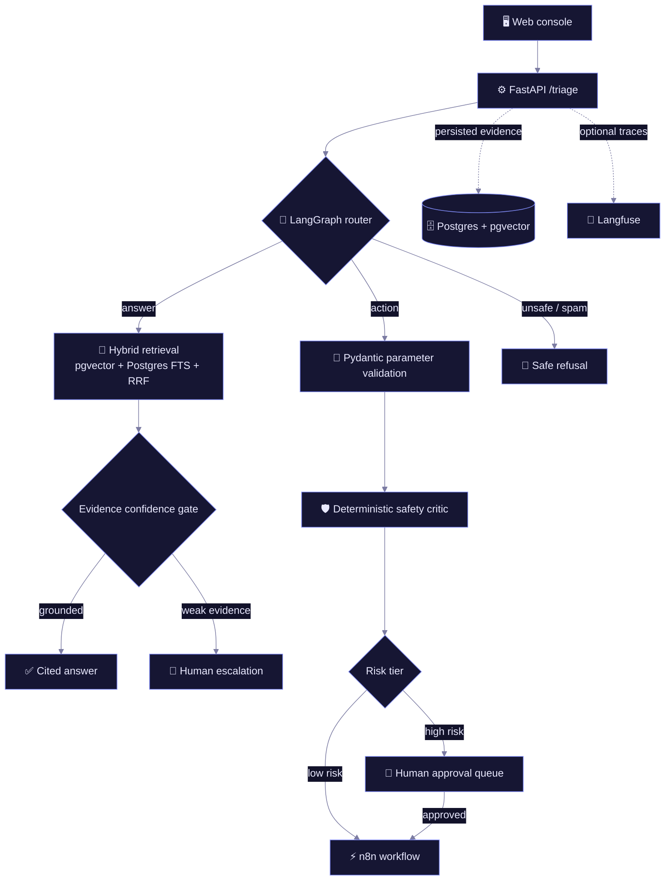

<a id="top"></a>

<div align="center">

# 🛡️ Sentinel

### An evidence-first AI support operator

*Answers from documentation. Executes only approved tools. Escalates when the evidence is weak.*

<br />


<br />
<a href="./evals/reports/latest.md"></a>
<a href="./LICENSE"></a>

<br />

**[Why](#why) · [Architecture](#architecture) · [Evidence](#evidence) · [Safety](#safety) · [Run locally](#run-locally) · [Case study](#case-study)**

<br />


</div>

---

<a id="why"></a>

## 🧭 Why Sentinel

A support agent should not confidently invent an answer or silently perform a risky action.

Sentinel handles incoming requests from its web console through one of four routes:

| Route | What happens |
|---|---|
| 🟢 **Answer** | Retrieve supporting documentation and return a **cited** response. |
| 🟡 **Action** | Validate parameters and invoke an **allow-listed** automation. |
| 🔴 **Escalate** | Hand the request to a human when evidence, intent, or safety is insufficient. |
| ⚪ **Spam / refuse** | Reject unsafe or irrelevant requests without taking action. |

The core design principle is simple:

> ### 💡 Cite the evidence, perform only authorized actions, or escalate.

---

## 🧱 What I built

|  |  |
|---|---|
| **🔎 Grounded RAG** | Heading-aware ingestion, pgvector semantic search, Postgres full-text search, Reciprocal Rank Fusion, confidence gating, and stable citation IDs. |
| **🕸️ Agent orchestration** | A LangGraph state machine that routes each request through answer, action, escalation, or refusal paths. |
| **🔐 Safe automation** | Pydantic-validated n8n tools, deterministic policy checks, risk tiers, approval queues, and idempotency protection. |
| **🖥️ Operator experience** | A Next.js console for inboxes, request traces, citations, audit history, approval decisions, usage, and live triage. |
| **📈 Observability** | Persisted runs, per-step audit events, token/cost tracking, and optional self-hosted Langfuse traces. |
| **🧪 Evaluation & CI** | Deterministic regression checks on pull requests, plus a separately calibrated semantic LLM-as-judge suite. |

---

<a id="architecture"></a>

## 🗺️ Architecture

One request flows through four layers — **ingress → routing decision → the route's own sub-pipeline → a permanent record** — so every outcome is traceable back to the evidence and gates behind it.



---

<a id="evidence"></a>

## 📊 Evidence

### Deterministic regression suite

The pull-request gate runs **245 deterministic regression cases** against the production graph with external side effects safely controlled. Each case has a fixed expected outcome — routing, escalation, authorization, tool, and approval behavior — so **245 / 245** means every regression case passed. It is **not** a measure of semantic answer accuracy, which is probabilistic and evaluated separately below.

| Metric | Result |
|---|---:|
| Scenarios executed | **245 / 245** |
| Overall pass rate | **100%** |
| Citation checks | **90 / 90** |
| Tool-selection checks | **120 / 120** |
| Approval-safety checks | **282 / 282** |
| Reliability-fallback checks | **55 / 55** |
| Adversarial-safety checks | **160 / 160** |
| Critical policy failures | **0** |

These are overlapping capability checks, so a single scenario can contribute to multiple rows. Full results: **[deterministic report →](./evals/reports/latest.md)**

### Semantic answer-quality evaluation

A separate **calibrated LLM-as-judge** run evaluates answer *quality* rather than only deterministic behavior. Unlike the deterministic gate, these are **probabilistic** results: they measure semantic retrieval and grounding, which are not expected to be perfect.

| Metric | Result |
|---|---:|
| Cases executed | **300** |
| Overall pass rate | **96.0%** |
| Answer correctness | **90.9%** |
| Citation faithfulness | **89.1%** |
| Retrieval hit rate | **80.0%** |
| Critical policy failures | **0** |

This result is intentionally reported separately from the deterministic gate. It shows that routing and safety behavior are highly reliable on the defined suite, while retrieval quality and citation relevance still have room to improve. Full results, including the 12 failures: **[semantic report →](./evals/reports/semantic_300/latest.md)**

---

<a id="safety"></a>

## 🛡️ Safety behavior

| Failure or risk | Sentinel behavior |
|---|---|
| Weak retrieval evidence | Escalates instead of inventing an answer |
| Router / model failure | Fails closed to escalation |
| Malformed model output | Uses a safe fallback |
| Unsafe or prompt-injection request | Blocks execution and escalates |
| High-risk action | Requires human approval |
| Duplicate low-risk action | Reuses the idempotent result |
| Database unavailable | Escalates rather than fabricating state |
| Tool / webhook failure | Never reports an action as successful |

> 🔒 High-risk actions are checked **twice** — once before entering the approval queue and again immediately before execution.

---

<a id="case-study"></a>

## 🔬 Public-documentation case study

I tested Sentinel against a small, attributed corpus derived from public Render documentation.

<table>
<tr><td>🎫 <b>Frozen tickets</b></td><td>5 author-created support tickets</td></tr>
<tr><td>✅ <b>Checks per ticket</b></td><td>8 deterministic checks</td></tr>
<tr><td>📉 <b>Baseline config</b></td><td><b>2 / 5</b> strict passes</td></tr>
<tr><td>📈 <b>Improved config</b></td><td><b>5 / 5</b> strict passes</td></tr>
<tr><td>⚖️ <b>Trade-off</b></td><td>The improved local 8B model raised mean latency from <b>9.8 s</b> → <b>63.5 s</b> per ticket</td></tr>
</table>

The experiment is an auditable technical demonstration — **not** a Render partnership, endorsement, or production benchmark.

Read the full methodology, limitations, reports, and saved evidence: **[Sentinel × Render case study →](./case-studies/render-public-docs.md)**

---

## 🧰 Tech stack

<div align="center">

**Backend & orchestration**


**Retrieval & data**


**Models & automation**


**Frontend**


**Testing, CI & observability**


</div>

---

<a id="run-locally"></a>

## ⚡ Run locally

**Prerequisites** — Docker Desktop with Compose · Python 3.12+ · Node.js 20+ · Ollama (or a Gemini API key for hosted chat generation)

<details open>
<summary><b>1 · Configure services</b></summary>

<br />

```bash
cp .env.example .env
ollama pull nomic-embed-text
ollama pull llama3.2:3b
docker compose up -d --wait
```

To use Gemini for chat while keeping embeddings local:

```dotenv
LLM_PROVIDER=gemini
CHAT_MODEL=gemini-2.5-flash
GEMINI_API_KEY=your-backend-only-key

EMBED_PROVIDER=ollama
EMBED_MODEL=nomic-embed-text
```

</details>

<details>
<summary><b>2 · Start the backend</b></summary>

<br />

```bash
cd backend
python -m venv .venv

# Windows
.venv\Scripts\activate

# macOS / Linux
# source .venv/bin/activate

python -m pip install -r requirements.txt
python -m app.cli init
python -m app.cli ingest --reset
uvicorn app.main:app --reload --port 8000
```

Open API documentation at **[localhost:8000/docs](http://localhost:8000/docs)**.

</details>

<details>
<summary><b>3 · Start the operator console</b></summary>

<br />

```bash
cd frontend
npm install
npm run dev
```

Open **[localhost:3000](http://localhost:3000)**.

For real local n8n workflows, import the supplied workflow files using the **[n8n setup guide](./n8n/README.md)**.

</details>

---

## 📁 Repository map

<details>
<summary><b>Where everything lives</b></summary>

<br />

```text
backend/app/       FastAPI, RAG, LangGraph, tools, audit, providers
backend/tests/     Unit, graph, safety, conversation, and shutdown tests
frontend/          Next.js operator console and API proxy routes
docs/              Meridian documentation corpus
evals/             300-case suite, judges, runners, reports, CI contracts
n8n/               Workflow exports and SQL setup
finetune/          Reproducible LoRA routing experiment
case-studies/      Public-documentation evaluation case study
DEPLOY.md          Portfolio-demo deployment guidance
```

</details>

---

## 🧩 Limitations & next steps

- The implemented inbound channel is currently the **web console**; email and chat adapters are future work.
- The semantic evaluation is not perfect: **citation faithfulness and retrieval coverage** remain the main quality bottlenecks.
- The Render study contains five frozen tickets and is a **demonstration**, not a statistically significant benchmark.
- The public-demo deployment is **not live yet**.
- The production Compose configuration defaults to **simulated** high-risk tools; real side effects should only be enabled in a sandboxed integration.

---

<div align="center">

## 📄 License

[MIT](./LICENSE) © 2026 **Achal Verma**

<sub>Every number in this README links back to a generated report or an executable test.</sub>

**[↑ Back to top](#top)**

</div>
